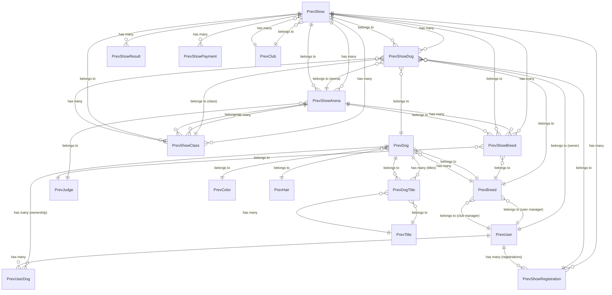

# Laravel Models Documentation - IKC Development

## Overview

This document provides a comprehensive mapping and documentation of Laravel models in the IKC (Israeli Kennel Club) development application. The application manages dog shows, registrations, breeds, judges, and related entities for kennel club operations.

## Database Connections

The application uses multiple database connections:

- **`mysql`** - Primary Laravel application database
- **`mysql_prev`** - Legacy database containing show management data (used by all Prev* models)

## Model Mappings

Based on the original intended structure and current implementation, here are the model mappings:

### Current Models (Implemented)

| Model File | Database Table | Semantic Name | Connection | Status |
|------------|----------------|---------------|------------|---------|
| `PrevShow.php` | `ShowsDB` | Shows | `mysql_prev` | ✅ Implemented |
| `PrevShowDog.php` | `Shows_Dogs_DB` | Show Dogs | `mysql_prev` | ✅ Implemented |
| `PrevShowArena.php` | `Shows_Structure` | Show Arenas | `mysql_prev` | ✅ Implemented |
| `PrevShowBreed.php` | `Shows_Breeds` | Show Breeds | `mysql_prev` | ✅ Implemented |
| `PrevShowClass.php` | `Shows_Classes` | Show Classes | `mysql_prev` | ✅ Implemented |
| `PrevShowResult.php` | `shows_results` | Show Results/Report | `mysql_prev` | ✅ Implemented |
| `PrevJudge.php` | `JudgesDB` | Judges | `mysql_prev` | ✅ Implemented |
| `PrevBreed.php` | `BreedsDB` | Breeds | `mysql_prev` | ✅ Implemented |
| `PrevDog.php` | `DogsDB` | Dogs | `mysql_prev` | ✅ Implemented |
| `PrevShowRegistration.php` | `shows_registration` | Show Registrations | `mysql_prev` | ✅ Implemented |
| `PrevShowPayment.php` | `shows_payments_info` | Show Registration Payments | `mysql_prev` | ✅ Implemented |

### Additional Support Models

| Model File | Database Table | Semantic Name | Connection | Purpose |
|------------|----------------|---------------|------------|---------|
| `PrevUser.php` | `users` | Users | `mysql_prev` | User management and dog owners |
| `PrevClub.php` | `clubs` | Clubs | `mysql_prev` | Kennel club management |
| `PrevColor.php` | `colors` | Dog Colors | `mysql_prev` | Dog color classifications |
| `PrevHair.php` | `hairs` | Hair Types | `mysql_prev` | Dog hair type classifications |
| `PrevTitle.php` | `dogs_titles_db` | Dog Titles | `mysql_prev` | Dog awards and titles |
| `PrevDogTitle.php` | `Dogs_ScoresDB` | Dog Title Awards | `mysql_prev` | Pivot table for dog titles |
| `PrevUserDog.php` | `user_dogs` | User-Dog Relations | `mysql_prev` | User ownership of dogs |
| `User.php` | `users` | Application Users | `mysql` | Laravel application users |

### Planned Models (From Problem Statement)

| Original Model File | Database Table | Semantic Name | Current Status |
|---------------------|----------------|---------------|----------------|
| `ShowsDetails.php` | `ShowsDB` | Shows | ✅ Implemented as `PrevShow.php` |
| `Shows.php` | `Shows_Dogs_DB` | Show Dogs | ✅ Implemented as `PrevShowDog.php` |
| `Structures.php` | `Shows_Structure` | Show Arenas | ✅ Implemented as `PrevShowArena.php` |
| `StructureBreed.php` | `Shows_Breeds` | Show Breeds | ✅ Implemented as `PrevShowBreed.php` |
| `Structureclasses.php` | `Shows_Classes` | Show Classes | ✅ Implemented as `PrevShowClass.php` |
| `ShowsResults.php` | `shows_results` | Show Results/Report | ✅ Implemented as `PrevShowResult.php` |
| `JudgesDB.php` | `JudgesDB` | Judges | ✅ Implemented as `PrevJudge.php` |
| `BreedsDB.php` | `BreedsDB` | Breeds | ✅ Implemented as `PrevBreed.php` |
| `DogsDB.php` | `DogsDB` | Dogs | ✅ Implemented as `PrevDog.php` |
| `ShowRegistration.php` | `shows_registration` | Show Registrations | ✅ Implemented as `PrevShowRegistration.php` |
| `ShowsPaymentsInfo.php` | `shows_payments_info` | Show Registration Payments | ✅ Implemented as `PrevShowPayment.php` |
| `ShowWinner.php` | `show_winners` | Show Winners | ❌ Not yet implemented |

## Model Relationships

### Core Show Management



### Key Model Relationships Detail

#### PrevShow (Shows)
- **Table:** `ShowsDB`
- **Primary Key:** `id`
- **Relationships:**
  - `hasMany(PrevShowRegistration)` - Show registrations
  - `hasMany(PrevShowDog)` - Dogs registered in the show
  - `hasMany(PrevShowResult)` - Show results
  - `hasMany(PrevShowPayment)` - Payment records
  - `hasMany(PrevShowBreed)` - Breeds in the show
  - `hasMany(PrevShowArena)` - Show arenas/structures

#### PrevShowDog (Show Dogs)
- **Table:** `Shows_Dogs_DB`
- **Primary Key:** `id`
- **Relationships:**
  - `belongsTo(PrevShow)` via `ShowID`
  - `belongsTo(PrevShowArena)` via `ArenaID`
  - `belongsTo(PrevShowClass)` via `ClassID`
  - `belongsTo(PrevShowRegistration)` via `ShowRegistrationID`
  - `belongsTo(PrevDog)` via `SagirID`
  - `belongsTo(PrevBreed)` via `BreedID`
  - `belongsTo(PrevUser)` via `OwnerID`

#### PrevShowArena (Show Arenas/Structures)
- **Table:** `Shows_Structure`
- **Primary Key:** `id`
- **Relationships:**
  - `belongsTo(PrevShow)` via `ShowID`
  - `belongsTo(PrevJudge)` via `JudgeID`
  - `hasMany(PrevShowClass)` - Classes in this arena
  - `hasMany(PrevShowBreed)` - Breeds in this arena

#### PrevShowRegistration (Show Registrations)
- **Table:** `shows_registration`
- **Primary Key:** `id`
- **Relationships:**
  - `belongsTo(PrevShow)` via `ShowID`
  - `belongsTo(PrevDog)` via `SagirID`
  - `hasMany(PrevShowDog)` - Dogs from this registration

#### PrevDog (Dogs)
- **Table:** `DogsDB`
- **Primary Key:** `SagirID`
- **Relationships:**
  - `belongsTo(PrevBreed)` via `RaceID`
  - `hasMany(PrevShowDog)` - Show participations
  - `belongsToMany(PrevTitle)` - Dog titles/awards

#### PrevBreed (Breeds)
- **Table:** `BreedsDB`
- **Primary Key:** `BreedCode`
- **Relationships:**
  - `hasMany(PrevDog)` via `RaceID`
  - `belongsTo(PrevUser, 'userManager')` via `UserManagerID`
  - `belongsTo(PrevUser, 'clubManager')` via `ClubManagerID`

## Controllers

### Primary Controllers (To Be Implemented)

| Controller | Purpose | Current Status |
|------------|---------|----------------|
| `ShowManagementController.php` | Shows management | ❌ Not implemented |
| `FrontShowController.php` | Shows live management (Native) | ❌ Not implemented |
| `AdminStructureController.php` | Shows Arenas (show structures) | ❌ Not implemented |

### Secondary Controllers (To Be Implemented)

| Controller | Purpose | Current Status |
|------------|---------|----------------|
| `AdminJudgeController.php` | Judges management | ❌ Not implemented |
| `BackendBreedController.php` | Breeds management | ❌ Not implemented |

### Current Controller Status

Currently, only the base `Controller.php` exists in `app/Http/Controllers/`. All specific controllers mentioned above need to be implemented.

## Model Characteristics

### Soft Deletes
Most models use Laravel's `SoftDeletes` trait:
- ✅ `PrevShow`, `PrevShowDog`, `PrevShowArena`, `PrevShowClass`, `PrevShowResult`
- ✅ `PrevShowRegistration`, `PrevShowPayment`, `PrevBreed`, `PrevDog`
- ❌ `PrevShowBreed`, `PrevJudge` (no timestamps/soft deletes)

### Legacy Compatibility
Many models include **legacy wrapper methods** to maintain backward compatibility with the original codebase:

**Example from PrevShowDog:**
```php
// Modern normalized relationships
public function show(): BelongsTo { return $this->belongsTo(PrevShow::class, 'ShowID'); }
public function dog(): BelongsTo { return $this->belongsTo(PrevDog::class, 'SagirID', 'SagirID'); }

// Legacy wrappers for backward compatibility  
public function showID(): BelongsTo { return $this->show(); }
public function sagirID(): BelongsTo { return $this->dog(); }
```

This pattern ensures that existing code using the old method names continues to work while providing cleaner, modern relationship names.

### Query Scopes
Models include helpful query scopes for common filtering:

**PrevShow Scopes:**
```php
#[Scope]
protected function activeShow(Builder $q): void {
    $q->where('ShowStatus', '=', 2);
}

#[Scope]
protected function upcoming(Builder $q): void {
    $q->whereDate('StartDate', '>', now());
}
```

Usage examples:
```php
// Get only active shows
$activeShows = PrevShow::activeShow()->get();

// Get upcoming shows
$upcomingShows = PrevShow::upcoming()->get();
```

### Database Connection
All `Prev*` models use the `mysql_prev` connection, indicating they work with a legacy database system.

### Primary Keys
- Most models use standard `id` as primary key
- **Exceptions:**
  - `PrevShowResult` uses `DataID`
  - `PrevShowBreed` uses `DataID`
  - `PrevJudge` uses `DataID`
  - `PrevDog` uses `SagirID`
  - `PrevBreed` uses `BreedCode`

## Key Fields and Casts

### Common Fields Across Models
- `ShowID` - References the show
- `DataID` - Legacy primary key in some models
- `JudgeID` - References judges
- `BreedID`/`RaceID` - References breeds
- Various price fields in `PrevShow` for different registration types
- DateTime fields: `ModificationDateTime`, `CreationDateTime`

### Important Casts
All models properly cast integer IDs and datetime fields to their appropriate types for Laravel 12.x compatibility.

## Missing Components

### Models Not Yet Implemented
1. **ShowWinner Model** - Should map to `show_winners` table for managing show winners

### Controllers Not Yet Implemented
All controllers mentioned in the problem statement need to be created:
1. Primary controllers for show management
2. Secondary controllers for judges and breeds
3. Frontend controllers for live show management

## Database Schema Considerations

The application works with both current Laravel standards and a legacy database system (`mysql_prev`), requiring careful attention to:

- Field naming conventions (legacy vs Laravel standards)
- Relationship key mapping
- Data type casting
- Soft delete handling across different table structures

## Filament Integration

The application is fully integrated with Filament v3.x for admin panel functionality. Each major model has corresponding Filament resources:

### Implemented Filament Resources

| Model | Filament Resource | Admin Features |
|-------|-------------------|----------------|
| `PrevShow` | `PrevShowResource` | Show management interface |
| `PrevShowRegistration` | `PrevShowRegistrationResource` | Registration management |
| `PrevShowArena` | `PrevShowArenaResource` | Arena/structure management |
| `PrevShowBreed` | `PrevShowBreedResource` | Show breed management |
| `PrevUser` | `PrevUserResource` | Legacy user management |
| `PrevJudge` | `PrevJudgeResource` | Judge management |
| `PrevColor` | `PrevColorResource` | Dog color management |
| `User` | `UserResource` | Application user management |

### Policy Integration
Each model has corresponding policy classes for authorization:
- `PrevShowPolicy`, `PrevShowRegistrationPolicy`, `PrevShowArenaPolicy`
- `PrevUserPolicy`, `PrevJudgePolicy`, `PrevBreedPolicy`
- `PrevDogPolicy`, `PrevColorPolicy`, `PrevHairPolicy`
- And others for complete RBAC (Role-Based Access Control)

### Observer Integration
Key models have observer classes for handling model events:
- `PrevDogObserver` - Handles dog-related events
- `PrevBreedObserver` - Handles breed-related events

This ensures proper event handling, validation, and business logic enforcement across the admin panel.

## Next Steps

1. **Implement Missing Models:**
   - Create `PrevShowWinner` model for `show_winners` table

2. **Implement Controllers:**
   - `ShowManagementController` for general show management
   - `FrontShowController` for live show management  
   - `AdminStructureController` for arena/structure management
   - `AdminJudgeController` for judge management
   - `BackendBreedController` for breed management

3. **Enhance Relationships:**
   - Add any missing relationship methods
   - Ensure proper eager loading configurations
   - Add relationship constraints where needed

4. **Documentation:**
   - Add PHPDoc blocks to all models
   - Document complex business logic
   - Add relationship examples

---

*This documentation reflects the current state of the Laravel models as of the analysis date. The application follows Laravel 12.x standards with Filament v3.x integration.*