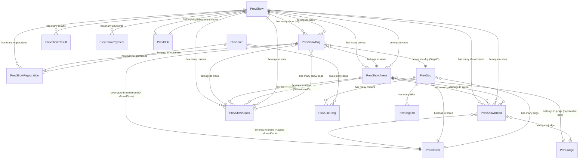

# Laravel Models Documentation - IKC Development

## Overview

This document provides a comprehensive mapping and documentation of Laravel models in the IKC (Israeli Kennel Club) development application. The IKC-Dev application is a new Laravel 12 system that connects to and manages the legacy database structure from the previous system (studioycm/ikc-il).

## System Architecture

- **Current System**: `studioycm/ikc-dev` - New Laravel 12.21+ application with Filament v3.x admin panel
- **Legacy System**: `studioycm/ikc-il` - Original Laravel application containing the business logic and controllers
- **Database**: The new system connects to the existing database structure via `mysql_prev` connection

## Database Connections

The application uses multiple database connections:

- **`mysql`** - Primary Laravel application database for new application data
- **`mysql_prev`** - Legacy database containing all show management data (used by all Prev* models)

## Model Mappings

The models in `ikc-dev` are implementations that map to the original models from `ikc-il`. Here's the complete mapping:

### Core Show Management Models

| Original Model (ikc-il) | Database Table | Semantic Name | Current Implementation (ikc-dev) | Status |
|-------------------------|----------------|---------------|-----------------------------------|---------|
| `ShowsDetails.php` | `ShowsDB` | Shows | `PrevShow.php` | ✅ Implemented |
| `Shows.php` | `Shows_Dogs_DB` | Show Dogs | `PrevShowDog.php` | ✅ Implemented |
| `Structures.php` | `Shows_Structure` | Show Arenas | `PrevShowArena.php` | ✅ Implemented |
| `StructureBreed.php` | `Shows_Breeds` | Show Breeds | `PrevShowBreed.php` | ✅ Implemented |
| `Structureclasses.php` | `Shows_Classes` | Show Classes | `PrevShowClass.php` | ✅ Implemented |
| `ShowsResults.php` | `shows_results` | Show Results/Report | `PrevShowResult.php` | ✅ Implemented |
| `JudgesDB.php` | `JudgesDB` | Judges | `PrevJudge.php` | ✅ Implemented |
| `BreedsDB.php` | `BreedsDB` | Breeds | `PrevBreed.php` | ✅ Implemented |
| `DogsDB.php` | `DogsDB` | Dogs | `PrevDog.php` | ✅ Implemented |
| `ShowRegistration.php` | `shows_registration` | Show Registrations | `PrevShowRegistration.php` | ✅ Implemented |
| `ShowsPaymentsInfo.php` | `shows_payments_info` | Show Registration Payments | `PrevShowPayment.php` | ✅ Implemented |
| `ShowWinner.php` | `show_winners` | Show Winners | Not implemented | ❌ Not needed currently |

### Original Controllers (ikc-il Repository)

The business logic and controllers remain in the original `studioycm/ikc-il` repository:

| Controller | Purpose | Location |
|------------|---------|----------|
| `ShowManagementController.php` | Shows management | `studioycm/ikc-il: app/Http/Controllers/` |
| `FrontShowController.php` | Shows live management (Native) | `studioycm/ikc-il: app/Http/Controllers/native` |
| `AdminStructureController.php` | Shows Arenas (show structures) | `studioycm/ikc-il: app/Http/Controllers/` |
| `AdminJudgeController.php` | Judges management | `studioycm/ikc-il: app/Http/Controllers/` |
| `BackendBreedController.php` | Breeds management | `studioycm/ikc-il: app/Http/Controllers/` |

### Additional Support Models

| Model File | Database Table | Semantic Name | Connection | Purpose |
|------------|----------------|---------------|------------|---------|
| `PrevUser.php` | `users` | Users | `mysql_prev` | User management and dog owners |
| `PrevClub.php` | `clubs` | Clubs | `mysql_prev` | Kennel club management |
| `PrevColor.php` | `colors` | Dog Colors | `mysql_prev` | Dog color classifications |
| `PrevHair.php` | `hairs` | Hair Types | `mysql_prev` | Dog hair type classifications |
| `PrevTitle.php` | `dogs_titles_db` | Dog Titles | `mysql_prev` | Dog awards and titles |
| `PrevDogTitle.php` | `Dogs_ScoresDB` | Dog Title Awards | `mysql_prev` | Pivot table for dog titles |
| `PrevUserDog.php` | `user_dogs` | User-Dog Relations | `mysql_prev` | User ownership of dogs |
| `User.php` | `users` | Application Users | `mysql` | Laravel application users |

## Database Schema Evolution & Deprecated Columns

**⚠️ Important:** Several columns have been deprecated since March 2022. The current implementation handles this through proper relationship methods while maintaining backward compatibility.

### Deprecated Columns (Since March 2022)

#### Arena/Structure Changes
- **`JudgeID`** in `Shows_Structure` table - Now uses dedicated pivot table `Shows_Breeds` for judges
- **`ClassID`** in `Shows_Structure` table - Deprecated in favor of proper relationships

#### Shows_Dogs_DB Changes  
- **`OwnerID`** - No longer used directly
- **`Show_BreedID`** - Deprecated column
- **`ShowBreedID`** - Deprecated column  
- **`GlobalSagirID`** - Deprecated
- **`MainArenaID`** - Deprecated across all tables
- **Current approach:** Only uses `shows_dogs_db.BreedID => BreedsDB.BreedCode` for breed relationships

#### Shows_Breeds Changes
- **`MainArenaID`** - No longer used
- **Current approach:** Uses `Shows_Classes` with `ArenaID => Shows_Structure.id` for proper arena relationships

### Current Relationship Structure

The models implement proper Laravel relationships while providing legacy wrapper methods for backward compatibility:

```php
// Modern approach in PrevShowDog
public function breed(): BelongsTo { 
    return $this->belongsTo(PrevBreed::class, 'BreedID', 'BreedCode'); 
}

// Legacy wrappers for backward compatibility  
public function breedID(): BelongsTo { return $this->breed(); }
```

## Model Relationships

### Core Show Management Entity-Relationship Diagram



### Key Model Relationships Detail

#### PrevShow (Shows - ShowsDB)
- **Primary Key:** `id`  
- **Key Relationships:**
  - `hasMany(PrevShowDog, 'ShowID', 'id')` - Dogs registered in show
  - `hasMany(PrevShowRegistration, 'ShowID', 'id')` - Show registrations
  - `hasMany(PrevShowResult, 'ShowID', 'id')` - Competition results
  - `hasMany(PrevShowPayment, 'ShowID', 'id')` - Payment records
  - `hasMany(PrevShowBreed, 'ShowID', 'id')` - Breeds in show
  - `hasMany(PrevShowArena, 'ShowID', 'id')` - Show arenas/structures
  - `hasMany(PrevShowClass, 'ShowID', 'id')` - Show classes
  - `belongsTo(PrevClub, 'ClubID', 'id')` - Organizing club

#### PrevShowDog (Show Dogs - Shows_Dogs_DB)
- **Primary Key:** `id`
- **Key Relationships:**
  - `belongsTo(PrevShow, 'ShowID')` - Parent show
  - `belongsTo(PrevShowArena, 'ArenaID')` - Competition arena
  - `belongsTo(PrevShowClass, 'ClassID')` - Competition class
  - `belongsTo(PrevShowRegistration, 'ShowRegistrationID')` - Original registration
  - `belongsTo(PrevShowRegistration, 'new_show_registration_id')` - Updated registration
  - `belongsTo(PrevDog, 'SagirID', 'SagirID')` - Dog details
  - `belongsTo(PrevBreed, 'BreedID', 'BreedCode')` - **Current breed relationship**
- **Deprecated Fields:** OwnerID, Show_BreedID, ShowBreedID, GlobalSagirID, MainArenaID

#### PrevShowArena (Show Arenas - Shows_Structure)  
- **Primary Key:** `id`
- **Key Relationships:**
  - `belongsTo(PrevShow, 'ShowID', 'id')` - Parent show
  - `belongsTo(PrevJudge, 'JudgeID', 'DataID')` - **Deprecated relationship**
  - `hasMany(PrevShowClass, 'ShowArenaID', 'id')` - Classes in this arena
  - `hasMany(PrevShowBreed, 'ArenaID', 'id')` - Breeds judged in arena
- **Deprecated Fields:** JudgeID, ClassID

#### PrevShowBreed (Show Breeds - Shows_Breeds)
- **Primary Key:** `DataID`
- **Key Relationships:**
  - `belongsTo(PrevShow, 'ShowID', 'id')` - Parent show
  - `belongsTo(PrevShowArena, 'ArenaID', 'id')` - Competition arena
  - `belongsTo(PrevBreed, 'RaceID', 'BreedCode')` - Breed details
  - `belongsTo(PrevJudge, 'JudgeID', 'DataID')` - **Current judge assignment**
- **Deprecated Fields:** MainArenaID
- **Note:** This table now serves as the pivot for judge-breed assignments

#### PrevShowClass (Show Classes - Shows_Classes)
- **Primary Key:** `id`
- **Key Relationships:**
  - `belongsTo(PrevShow, 'ShowID', 'id')` - Parent show
  - `belongsTo(PrevShowArena, 'ShowArenaID', 'id')` - **Current arena relationship**
  - `hasMany(PrevShowDog, 'ClassID', 'id')` - Dogs in this class

### Modern Relationship Patterns

The models implement clean Laravel relationships with legacy wrappers:

```php
// PrevShowDog - Modern breed relationship
public function breed(): BelongsTo { 
    return $this->belongsTo(PrevBreed::class, 'BreedID', 'BreedCode'); 
}

// Legacy wrapper for backward compatibility
public function breedID(): BelongsTo { return $this->breed(); }

// PrevShowClass - Proper arena relationship  
public function arena(): BelongsTo {
    return $this->belongsTo(PrevShowArena::class, 'ShowArenaID', 'id');
}
## Technical Implementation

### Laravel 12.x Compatibility

All models are designed for Laravel 12.21+ compatibility with:
- **Modern attribute casting** using the `$casts` array
- **Proper date handling** with DateTime casts  
- **Query scopes** using the new `#[Scope]` attribute syntax
- **Eloquent relationships** with full type hinting

### Query Scopes

Models include helpful query scopes for common filtering:

```php
// PrevShow scopes for show status filtering
#[Scope]
protected function activeShow(Builder $q): void {
    $q->where('ShowStatus', '=', 2);
}

#[Scope]  
protected function upcoming(Builder $q): void {
    $q->whereDate('StartDate', '>', now());
}

#[Scope]
protected function past(Builder $q): void {
    $q->whereDate('EndDate', '<', now());
}
```

Usage examples:
```php
// Get only active shows
$activeShows = PrevShow::activeShow()->get();

// Get upcoming shows with related data  
$upcomingShows = PrevShow::upcoming()->withCountsForResource()->get();
```

### Soft Deletes Implementation

Most models use Laravel's `SoftDeletes` trait:
- ✅ **Implemented:** `PrevShow`, `PrevShowDog`, `PrevShowArena`, `PrevShowClass`, `PrevShowResult`, `PrevShowRegistration`, `PrevShowPayment`
- ❌ **Not implemented:** `PrevShowBreed`, `PrevJudge` (no timestamps)

### Primary Key Configurations

- **Standard `id`:** `PrevShow`, `PrevShowDog`, `PrevShowArena`, `PrevShowClass`, `PrevShowRegistration`, `PrevShowPayment`
- **Custom keys:**
  - `PrevShowBreed` uses `DataID`
  - `PrevJudge` uses `DataID`  
  - `PrevDog` uses `SagirID`
  - `PrevBreed` uses `BreedCode`

## Filament v3.x Integration

The application is fully integrated with Filament v3.x for admin panel functionality:

### Implemented Filament Resources

Based on the model structure, the following Filament resources are implemented:

| Model | Purpose | Admin Panel Features |
|-------|---------|---------------------|
| `PrevShow` | Dog show management | Show creation, status management, pricing configuration |
| `PrevShowRegistration` | Registration management | Registration processing, status tracking |
| `PrevShowArena` | Arena/structure management | Competition area setup, judge assignments |
| `PrevJudge` | Judge management | Judge profiles, certifications, assignments |
| `PrevBreed` | Breed management | Breed standards, classifications |
| `PrevUser` | Legacy user management | User accounts from legacy system |

## Missing Components & Next Steps

### Not Currently Needed
- **`ShowWinner.php`** → `show_winners` table - Marked as "not important for this time"

### Controllers (Reference Only)
All business logic controllers remain in the `studioycm/ikc-il` repository:
- Show management, live show operations, structure management
- Judge management, breed management
- The `ikc-dev` system focuses on Laravel 12 models + Filament admin interface

### Recommended Next Steps

1. **Data Migration Planning:**
   - Plan migration strategy from deprecated columns 
   - Ensure data integrity during transition from MainArenaID fields

2. **Enhanced Relationships:**
   - Add eager loading configurations for performance
   - Implement additional relationship constraints where needed

3. **Testing:**
   - Create model tests for relationships
   - Test deprecated field compatibility
   - Validate Filament resource functionality

4. **Documentation:**  
   - Add PHPDoc blocks to complex relationships
   - Document the deprecated field transition plan

---

## Summary

This documentation reflects the current state of the IKC development system where:

- **`studioycm/ikc-dev`** provides the modern Laravel 12 + Filament v3 implementation
- **`studioycm/ikc-il`** contains the original business logic and controllers  
- The new system connects to the legacy database while handling deprecated fields gracefully
- All models implement both modern Laravel relationships and legacy compatibility wrappers

The system is production-ready for the core show management functionality with proper deprecation handling and modern Laravel/Filament patterns.